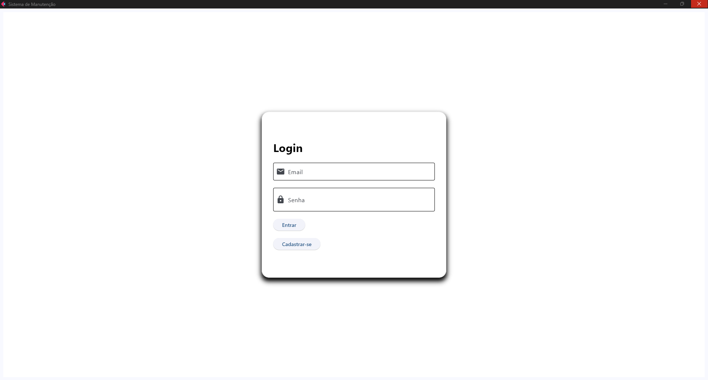
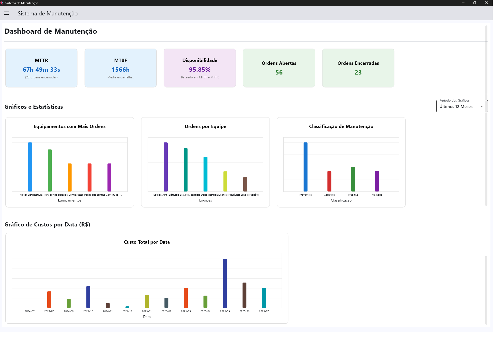
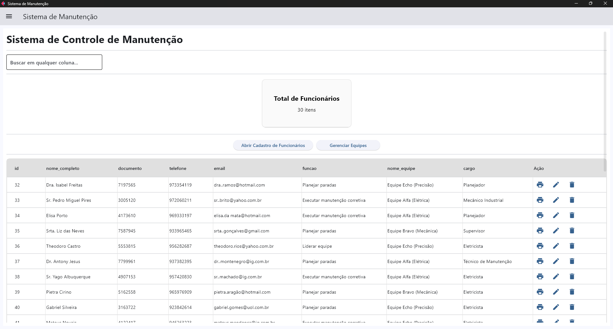
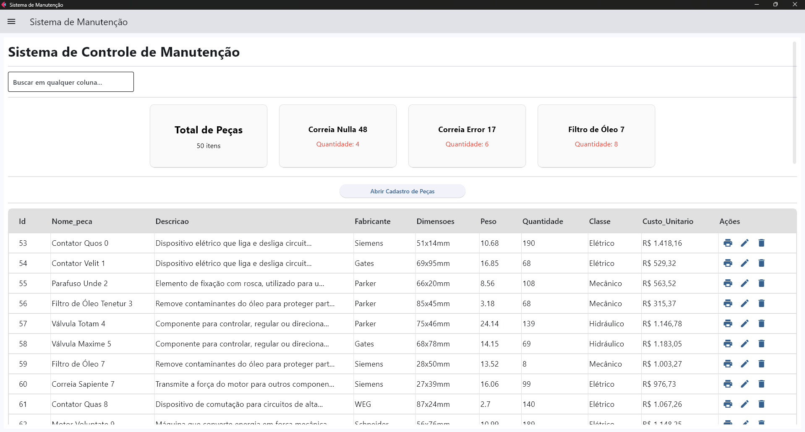

<h1>MANUTENCAO - Sistema Inteligente de Gerenciamento de Manutenção</h1>

<em>Empowering Maintenance Excellence Through Intelligent Management</em>

<em>Built with the tools and technologies:</em>

 

<h2>Table of Contents</h2>
<ul class="list-disc pl-4 my-0">
<li class="my-0"><a href="#overview">Overview</a></li>
<li class="my-0"><a href="#features">Features</a></li>
<li class="my-0"><a href="#getting-started">Getting Started</a>
<ul class="list-disc pl-4 my-0">
<li class="my-0"><a href="#prerequisites">Prerequisites</a></li>
<li class="my-0"><a href="#installation">Installation</a></li>
<li class="my-0"><a href="#usage">Usage</a></li>
<li class="my-0"><a href="#testing">Testing</a></li>
</ul>
</li>
<li class="my-0"><a href="#screenshots">Screenshots</a></li>
</ul>

<h2 id="overview">Overview</h2>

manutencao is an all-in-one maintenance management system that provides a rich, interactive interface for overseeing maintenance workflows, equipment, personnel, and parts. It integrates core functionalities such as data management, analytics dashboards, log monitoring, and report generation to support efficient and transparent operations.

<strong>Why manutencao?</strong>

This project helps developers build and maintain robust maintenance workflows with ease. The core features include:

<ul class="list-disc pl-4 my-0">
<li class="my-0">🛠️ <strong>Dashboard &amp; Visualizations:</strong> Aggregates key metrics and project timelines for real-time operational insights.</li>
<li class="my-0">🔒 <strong>Secure Data &amp; Authentication:</strong> Ensures data integrity and user access control across the system.</li>
<li class="my-0">📊 <strong>Logs &amp; Auditability:</strong> Provides detailed change histories for transparency and compliance.</li>
<li class="my-0">🧩 <strong>Modular Data Management:</strong> Facilitates seamless CRUD operations for equipment, personnel, parts, and orders.</li>
<li class="my-0">📄 <strong>Reporting &amp; Export:</strong> Generates detailed PDFs for documentation and analysis.</li>
<li class="my-0">⚙️ <strong>Interactive UI Components:</strong> Dynamic tables and dialogs streamline user interactions and data editing.</li>
</ul>

<h2 id="features">Features</h2>

The platform offers a robust set of modules for comprehensive management:

<ul>
    <li>🔐 <strong>Login e Autenticação:</strong> Sistema de login seguro para controle de acesso.</li>
    <li>📊 <strong>Dashboard de Gerenciamento:</strong> Visão geral de KPIs e status de manutenção.</li>
    <li>📝 <strong>Gestão de Ordens de Serviço:</strong> Criação, atribuição, monitoramento e conclusão de ordens.</li>
    <li>👨‍🏭 <strong>Cadastro de Funcionários:</strong> Gerenciamento de dados de técnicos e equipes.</li>
    <li>⚙️ <strong>Cadastro de Peças e Equipamentos:</strong> Registro detalhado de ativos e seus componentes.</li>
    <li>📈 <strong>Visualização de Gantt:</strong> Planejamento e acompanhamento de tarefas em um gráfico de Gantt.</li>
    <li>📄 <strong>Geração de Relatórios PDF:</strong> Exportação de dados e ordens de serviço.</li>
    <li>🔍 <strong>Visualizador de Logs:</strong> Auditoria completa das ações do sistema.</li>
</ul>

<h2 id="getting-started">Getting Started</h2>
<h3>Prerequisites</h3>

This project requires the following dependencies:

<ul class="list-disc pl-4 my-0">
<li class="my-0"><strong>Programming Language:</strong> Python 3.8+</li>
<li class="my-0"><strong>Package Manager:</strong> pip</li>
</ul>
<h3>Installation</h3>

Build manutencao from the source and install dependencies:

<ol>
<li class="my-0">

<strong>Clone the repository:</strong>

<pre><code class="language-sh">❯ git clone https://github.com/theofeitoza/manutencao
</code></pre>
</li>
<li class="my-0">

<strong>Navigate to the project directory:</strong>

<pre><code class="language-sh">❯ cd manutencao
</code></pre>
</li>
<li class="my-0">

<strong>Create a virtual environment (recommended):</strong>

<pre><code class="language-sh"># For Windows
python -m venv venv
.\venv\Scripts\activate

# For macOS/Linux
python3 -m venv venv
source venv/bin/activate
</code></pre>
</li>
<li class="my-0">

<strong>Install the dependencies:</strong>

<pre><code class="language-sh">❯ pip install -r requirements.txt
</code></pre>
*(Note: If `requirements.txt` is not available, you might need to install Streamlit, Pandas, SQLite-related libraries manually).*
</li>
</ol>
<h3>Usage</h3>

Run the project with:

<pre><code class="language-sh">streamlit run main.py
</code></pre>

Then, open your web browser and navigate to the address provided in the terminal (usually <code>http://localhost:8501</code>).

<h3>Testing</h3>

Manutencao uses the {<strong>test_framework</strong>} test framework. Run the test suite with:

<strong>Using <a href="https://docs.conda.io/">conda</a>:</strong>

<pre><code class="language-sh">conda activate {venv}
pytest
</code></pre>

<h2 id="screenshots">Screenshots</h2>

### Tela de Login

  

### Dashboard Principal

  

### Gestão de Ordens de Serviço

  

### Cadastro de Funcionários

  

### Cadastro de Peças

  

### Diagrama de Gantt

  

### Aplicação do Técnico

  

### Banco de Dados

  

<a href="#top">⬆ Return</a>

